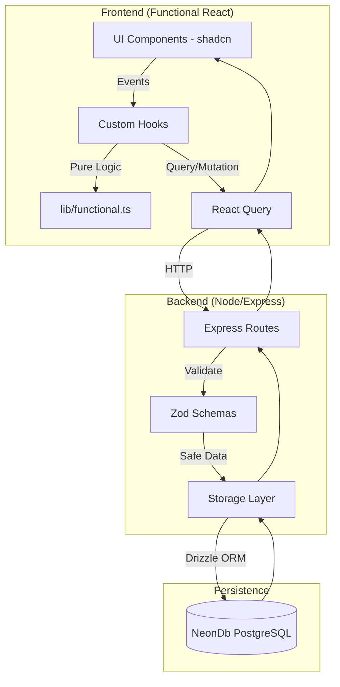

# Medical Appointment System – Architettura Software Funzionale

> **Documento operativo (stile imperativo)**
>
> Usa questo file per **installare**, **configurare**, **comprendere** e **utilizzare** l’architettura software del sistema di prenotazioni mediche basato su programmazione funzionale.

---

## 1. Definisci l’Obiettivo

- Gestisci appuntamenti medici in modo **type-safe**
- Applica **programmazione funzionale** end-to-end
- Valida i dati **prima** della persistenza
- Persiste lo stato su **NeonDb (PostgreSQL)**
- Mantieni separazione netta tra **UI, logica pura, effetti collaterali**

---

## 2. Struttura il Progetto

### Frontend (Client)

Percorso: `client/src/`

- `components/functional/`
  - Usa **componenti puri**
  - Esempi:
    - `AppointmentCard.tsx`
    - `DoctorBadge.tsx`

- `components/hocs/`
  - Componi comportamenti
  - Esempi:
    - `withAuth.tsx`
    - `withLoading.tsx`

- `hooks/`
  - Centralizza lo stato e gli effetti controllati
  - Esempio:
    - `useAppointments.ts` (React Query)

- `lib/functional.ts`
  - Inserisci **solo logica pura**
  - Esempi:
    - `isSlotAvailable`
    - `formatDate`

---

### Backend (Server)

Percorso: `server/`

- `db.ts`
  - Configura la connessione a **NeonDb**
  - Usa **Drizzle ORM**

- `storage.ts`
  - Isola gli **effetti collaterali**
  - Implementa CRUD asincrono

- `routes.ts`
  - Definisci API Express
  - Valida input con Zod

---

### Shared

Percorso: `shared/`

- `schema.ts`
  - Definisci:
    - Tabelle SQL (Drizzle)
    - Schemi di validazione (Zod)
    - Tipi TypeScript condivisi

---

## 3. Definisci lo Schema del Database

File: `shared/schema.ts`

```ts
import { pgTable, text, serial, timestamp } from "drizzle-orm/pg-core";
import { createInsertSchema } from "drizzle-zod";

export const appointments = pgTable("appointments", {
  id: serial("id").primaryKey(),
  patientName: text("patient_name").notNull(),
  doctorName: text("doctor_name").notNull(),
  appointmentDate: timestamp("appointment_date").notNull(),
  status: text("status").notNull().default("pending"),
});

export const insertAppointmentSchema = createInsertSchema(appointments);

export type Appointment = typeof appointments.$inferSelect;
export type InsertAppointment = typeof appointments.$inferInsert;
```

---

## 4. Implementa il Layer di Storage

File: `server/storage.ts`

```ts
import { appointments, type Appointment, type InsertAppointment } from "@shared/schema";
import { db } from "./db";

export interface IStorage {
  getAppointments(): Promise<Appointment[]>;
  createAppointment(a: InsertAppointment): Promise<Appointment>;
}

export class DatabaseStorage implements IStorage {
  async getAppointments() {
    return db.select().from(appointments);
  }

  async createAppointment(insertAppt: InsertAppointment) {
    const [appointment] = await db
      .insert(appointments)
      .values(insertAppt)
      .returning();

    return appointment;
  }
}

export const storage = new DatabaseStorage();
```

---

## 5. Controlla il Flusso dei Dati



---

## 6. Applica i Pattern Funzionali

- **Immutabilità**
  - Non mutare mai un appuntamento
  - Crea sempre una nuova istanza di stato

- **Validazione totale**
  - Blocca appuntamenti nel passato
  - Usa Zod **prima** del database

- **Composizione**

```ts
const SecureAppointmentList = withAuth(
  withLoading(AppointmentList)
);
```

- **Effetti collaterali isolati**
  - Solo `storage.ts` comunica con NeonDb

---

## 7. Configura NeonDb su Replit

### Imposta le Variabili d’Ambiente

- Apri **Secrets** su Replit
- Aggiungi:

```
DATABASE_URL=postgresql://...
```

---

## 8. Sincronizza il Database

```bash
npm install drizzle-orm @neondatabase/serverless
npm run db:push
```

---

## 9. Avvia l’Applicazione

```bash
npm run dev
```

---

## 10. Usa l’Architettura

- Aggiungi logica **solo** in funzioni pure
- Inserisci effetti **solo** nei layer dedicati
- Condividi i tipi tramite `shared/`
- Mantieni il flusso dati **unidirezionale**

---

✅ **Risultato**: un sistema medico robusto, predicibile, testabile e pronto per ambienti cloud.

